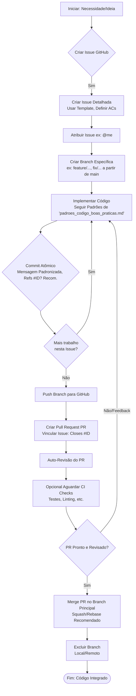

# Simulador de Frete Minimal

Aplicação Streamlit para simulação de frete e tributos (foco em como executar).

## Pré-requisitos

Antes de começar, certifique-se de ter o seguinte instalado:

*   **Git:** Para clonar o repositório.
*   **Python:** Versão 3.10 ou superior (o ambiente local no contexto usa 3.10.10, o Dev Container usa 3.11).
*   **Pip:** Gerenciador de pacotes Python (geralmente vem com o Python).
*   **(Para Opção 1) Docker:** Necessário para usar Dev Containers.
*   **(Para Opção 1) VS Code com a extensão Dev Containers:** Ou acesso a GitHub Codespaces.

## Configuração e Instalação

Existem duas maneiras principais de configurar o ambiente para rodar este projeto:

### Opção 1: Usando Dev Container (Recomendado)

Esta é a maneira mais simples, pois o ambiente já vem pré-configurado.

1.  **Clone o Repositório:**
    ```bash
    git clone https://github.com/ayrtonnotrya/simulador-frete-minimal.git
    cd simulador-frete-minimal
    ```
2.  **Abra no VS Code:** Abra a pasta clonada (`simulador-frete-minimal`) no Visual Studio Code.
3.  **Reabrir no Container:** O VS Code deve detectar o arquivo `.devcontainer/devcontainer.json` e sugerir reabrir o projeto dentro de um container. Clique em "Reopen in Container".
4.  **Aguarde:** O VS Code irá construir a imagem Docker (se ainda não existir) e instalar as dependências definidas no `devcontainer.json` (incluindo `streamlit`). Isso pode levar alguns minutos na primeira vez.

### Opção 2: Configuração Manual do Ambiente Local

Se você não quiser usar Dev Containers, siga estes passos:

1.  **Clone o Repositório:**
    ```bash
    git clone https://github.com/ayrtonnotrya/simulador-frete-minimal.git
    cd simulador-frete-minimal
    ```
2.  **Crie um Ambiente Virtual (Recomendado):**
    ```bash
    # Linux/macOS
    python3 -m venv .venv
    source .venv/bin/activate

    # Windows (cmd/powershell)
    python -m venv .venv
    .\.venv\Scripts\activate
    ```
    *(Nota: O contexto indicou que nenhum venv estava ativo no momento da coleta, mas usá-lo é uma boa prática)*
3.  **Instale as Dependências:** A dependência principal para rodar a aplicação é o Streamlit.
    ```bash
    pip install streamlit
    ```
    *(Nota: Um arquivo `requirements.txt` completo pode ser necessário futuramente ou se a aplicação evoluir para usar outras bibliotecas como Pandas, conforme mencionado em `doc/plano_de_acao.md`. O `env_pip_freeze.txt` no contexto lista todas as bibliotecas do ambiente de coleta, mas apenas `streamlit` é essencial para iniciar.)*

## Executando a Aplicação

*   **Se usando Dev Container:**
    *   A aplicação Streamlit deve iniciar automaticamente após o container ser construído e anexado, devido ao comando `postAttachCommand` no `devcontainer.json`.
    *   O VS Code também deve encaminhar a porta `8501` automaticamente e oferecer a opção de abrir a aplicação em uma aba de preview ou no seu navegador padrão.
    *   Se não iniciar automaticamente, abra um terminal dentro do VS Code (que já estará no container) e execute: `streamlit run simulador_frete.py`

*   **Se usando Ambiente Local:**
    1.  Certifique-se de que seu ambiente virtual (se criado) está ativado.
        ```bash
        # Exemplo Linux/macOS
        source .venv/bin/activate
        # Exemplo Windows
        # .\.venv\Scripts\activate
        ```
    2.  Execute o comando Streamlit a partir da raiz do projeto:
        ```bash
        streamlit run simulador_frete.py
        ```
    3.  Abra seu navegador e acesse o endereço fornecido pelo Streamlit (geralmente `http://localhost:8501`).

## Desenvolvimento e Contribuição

Para informações sobre como contribuir, padrões de código, fluxo de trabalho e ferramentas de automação (como `scripts/llm_interact.py` e `generate_context.sh`), consulte os documentos no diretório `doc/`:

*   `guia_desenvolvimento.md`
*   `padroes_codigo_boas_praticas.md`



